# LODESTAR

**Leadership-Oriented Defence: Exposure, Signal Triage And Reporting**

LODESTAR is a set of cooperating AI agents that read from the security tools you already own.
From that data it tells your security team what to work on **today, this week and this month**.
It also captures **bug bounty reports (HackerOne)** and **threat-intelligence feeds, advisories and
e-mails** from CERTs, ISACs and vendors, keeping what touches your assets. It queues the decisions
only a human may take, answers questions in **Slack and Microsoft Teams**, and writes the
**weekly, monthly and quarterly reports** that business leaders and boards actually read.

A lodestar is the star navigators steer by. The platform does the same job for a security team.

**[▶ Open the live demo dashboard](https://manabouprj.github.io/Lodestar/)** · [download it to open offline](samples/lodestar-dashboard.html) · [sample board report](samples/reports/sandline-bank-demo/2026-10-01_quarterly.md)

[](https://manabouprj.github.io/Lodestar/)

```
1,554 signals from 21 sources ─► 942 open ─► 203 this week ─► 28 today ─► 20 attack paths ─► 25 decisions for people
                                 (Sandline Bank, fictional demo, banking profile)
```

---

## What it achieves

| Outcome | How |
|---|---|
| **One priority list instead of 20 consoles** | 21 connector agents normalise EDR, firewall, VMDR, identity, PAM, cloud, ZTNA, web proxy, SOC/SIEM, SAST, DAST, WAF, brand protection, email, AI security, DLP, OT, backup, fraud, bug bounty and threat-intelligence data into one model |
| **A Today list a team can finish** | Explainable risk score with Today / This week / This month horizons and a capacity cap; every item says *why* it is there |
| **Outside warnings acted on, not lost in inboxes** | HackerOne reports (API + signed webhooks), STIX/TAXII, MISP, CISA ICS / vendor CSAF advisories and CERT/ISAC e-mails are captured, matched to assets by CVE, product and IOC, and turned into priorities and decisions. TLP is enforced, and critical-infrastructure notification deadlines are tracked |
| **Attacks that no single tool sees** | 16 correlation rules join signals into attack paths, e.g. a known-exploited bug under live attack on a crown jewel, lookalike phishing that turns into customer account takeover, or an ISAC indicator showing up in our own proxy logs |
| **Clear human accountability** | The Decision desk lists every action that needs a person: who decides, by when, what the agents prepared and what they will not do |
| **Security in the tools people already use** | Daily focus brief, urgent-decision alerts and two-way chat in Slack and Microsoft Teams |
| **Cyber and fraud in one view** | Fraud-engine signals joined with brand, identity and WAF signals for banks, fintechs, retailers, telcos and airlines |
| **Controls that are known to work** | Coverage, data freshness and policy drift measured for every control; a broken control becomes a finding |
| **Board-ready reporting** | KRIs against risk appetite, decisions requested from leadership, indicative financial exposure, framework readiness (NIST CSF 2.0, ISO 27001:2022, PCI DSS v4.0.1) |
| **One platform, any industry** | Industry profiles as YAML: banking, fintech, aviation, retail, oil & gas, power & utilities, telecom, ports & logistics |

## Who it is for

LODESTAR scales from a single container for a small team to a multi-entity deployment for a
group or government CERT. The agents are the same at every size. Only the number of connectors,
entities and channels changes.

| Team | Typical situation | How LODESTAR is used | Footprint |
|---|---|---|---|
| **Small team** (1-5 people, often with an MSP/MDR) | A handful of tools, no SOC, the IT manager doubles as security lead | Phase 1 with 3-5 connectors through vendor APIs or CSV exports; the Today list and Slack/Teams brief *are* the operating rhythm; quarterly report for the owner/board | One container (2 vCPU, 4 GB), SQLite |
| **Mid-size organisation** (in-house security team, outsourced or small SOC) | 10-15 tools, too many alerts, monthly management reporting done by hand | Phases 1-3; team queues per owner; Decision desk for change and containment approvals; monthly and quarterly reports generated automatically | One container + scheduler |
| **Enterprise** (CISO organisation, 24x7 SOC, GRC, fraud) | 18+ tools, several business units, regulators, board scrutiny | All phases; per-team Slack/Teams channels; ITSM hand-off; fraud fusion; framework readiness for audit | Container platform, PostgreSQL store (roadmap), SSO proxy |
| **Group / multi-entity / MSSP** | Several subsidiaries or clients in different industries | One config per entity with its own industry profile; comparable posture and KRIs across entities | Same image, one config per entity |
| **Government & critical infrastructure** | Mission-critical operations, OT, CERT/ISAC advisories, strict accountability | Dark operations-centre dashboard with TLP marking; CERT/ISAC/ICS advisories matched to OT assets; mandatory-notification decisions with deadlines; OT and safety-critical decisions reserved to named roles; on-premises, no cloud dependency; LLM off by default | On-premises / air-gapped capable |

## How a team works with it

| Cadence | Who | Where | What they get |
|---|---|---|---|
| Continuously | SOC, on-call | Slack / Teams alert | New decisions that need a human **now**, e.g. an ISAC indicator sighted, a researcher report under attack |
| Every morning | CISO, security leads | Dashboard + daily brief in chat | Posture, decisions due, Today list, broken controls |
| During the day | Analysts, control owners | Dashboard, `/lodestar` in Slack, `@LODESTAR` in Teams | Team queue, "why is this here?", record decisions |
| Weekly | Technical leads | Weekly report | Today/This-week lists with owners and due dates, attack paths, decisions waiting, control health |
| Monthly | CISO, CIO, risk committee | Monthly report | KRIs vs appetite, trends, framework readiness, decisions requested |
| Quarterly | Board / ExCo | Quarterly report | Posture against appetite, financial exposure range, threat landscape, investment decisions |

## Human in the loop

| Agents do | Agents never do |
|---|---|
| Collect read-only data, de-duplicate, enrich with CISA KEV / EPSS | Isolate hosts, reset or disable accounts |
| Score, rank and explain every item | Change firewall, WAF, PAM, IdP or cloud policy |
| Correlate attack paths across tools | Take down domains or contact customers |
| Draft tickets, takedown requests, customer notices, STR narratives | Hold, recall or release payments; freeze accounts |
| Queue each decision for a named role with a deadline | File regulatory reports (breach, STR/SAR) |
| Record verdicts with an audit trail | Accept risk on anyone's behalf |

Only an approved verdict releases a ticket to ITSM, and ITSM starts in dry-run mode. See
[docs/HUMAN_IN_THE_LOOP.md](docs/HUMAN_IN_THE_LOOP.md).

## The dashboard

The dashboard is dark-first, built for 24x7 operations rooms, with TLP marking and local/UTC
clocks. A light theme is available. It is a single self-contained page: served by the API in
production, or exported as one HTML file for presentations and air-gapped reviews. The live demo
uses fictional data only.

| Decision desk | Focus queue and attack paths |
|---|---|
| What needs a human now, who decides, by when, and what the agents will not do<br> | Every item explains why it is on the list<br> |
| **External reports & intelligence:** HackerOne reports and CERT/ISAC/PSIRT advisories, filtered to what touches us<br> | **Ask LODESTAR, and fraud & financial crime:** the same agent answers in Slack and Teams<br> |
| **KRIs against appetite and control assurance**<br> | **Critical infrastructure:** an ICS advisory matched to 20 PLCs, HMIs and RTUs at a utility<br> |

<details>
<summary>Light theme and phone layout</summary>


</details>

What the dashboard shows, top to bottom:

1. **Posture and signal funnel:** posture vs appetite, data-trust confidence, and the funnel from tool noise to today's focus.
2. **Decision desk:** decisions waiting on people, grouped Now / Today / This week, filterable by decider role.
3. **Focus queue:** Today, This week and This month, filterable by owner team and control, with "why it's here" and the recommended fix.
4. **Attack paths:** correlated multi-tool risks with MITRE ATT&CK techniques.
5. **External reports & intelligence:** HackerOne reports (SLA, bounty decisions, assets not in the CMDB) and CERT/ISAC/PSIRT advisories shown as *ingested → relevant → sighted*, with TLP labels.
6. **Ask LODESTAR:** chat with the prioritisation agent. The same answers go to Slack and Teams.
7. **Fraud & financial crime:** confirmed loss, prevented loss, detection before loss, backlog, channel coverage, cyber-enabled fraud paths.
8. **KRIs, control assurance, posture trend, team workload, framework readiness, remediation actions.**

## Architecture

```mermaid
flowchart LR
  subgraph Tools[Your security controls - read-only]
    EDR & VMDR & IDP[Identity] & SOC[SIEM/SOC] & MAIL[Email] & FW[Firewall] & WAF & SWG[Web proxy]
    ZTNA & PAM & CLOUD[CNAPP] & SAST & DAST & BRAND[Brand] & AI[AI security] & DLP & OT & BKP[Backup] & FRAUD[Fraud engine]
  end
  subgraph Ext[External reports & intelligence]
    H1[HackerOne] & TAXII[CERT / ISAC TAXII] & MISP & CSAF[CISA ICS / PSIRT CSAF] & MAILBOX[Advisory mailbox]
  end
  Tools -->|API / file drop / signed webhook| CA[21 connector agents]
  Ext -->|API / webhook / feeds / e-mail| CA
  CA --> AC[Asset context] --> DQ[Data quality] --> TI[Threat intel] --> CTL[Control assurance]
  CTL --> COR[Correlation] --> PRI[Prioritisation] --> CMP[Compliance] --> ACT[Action drafts] --> DEC[Decision desk]
  PRI --> ST[(Store)]
  DEC --> ST
  ST --> API[REST API + RBAC] --> DASH[Dashboard]
  ST --> REP[Reports + narrative]
  ST --> CHAT[ChatOps agent] <--> SLK[Slack] & TMS[Microsoft Teams]
  DEC -. human verdict .-> ITSM[ServiceNow / Jira]
  VP[[Industry profile YAML]] -.-> PRI & CMP & REP & DEC
```



34 agents: 21 connector agents and 13 core agents. Details are in
[docs/AGENT_CATALOG.md](docs/AGENT_CATALOG.md) and [docs/ARCHITECTURE.md](docs/ARCHITECTURE.md).

## Quick start

**Windows 11 (PowerShell)**

```powershell
git clone https://github.com/<you>/lodestar.git
cd lodestar
powershell -ExecutionPolicy Bypass -File scripts\setup.ps1 -Serve     # venv, tests, demo, serve
# open http://127.0.0.1:8080
```

**Linux / macOS**

```bash
./scripts/setup.sh --serve
```

**Docker**

```bash
cp .env.example .env                          # set API keys first
docker compose build
docker compose run --rm api python -m lodestar demo
docker compose up -d                          # API + dashboard + scheduler
```

**Talk to the agent without Slack or Teams**

```bash
python -m lodestar chat "what needs attention now?"
python -m lodestar chat --org sandline-bank-demo fraud
python -m lodestar chat                       # interactive
```

`python -m lodestar demo` builds eight **fictional** organisations, one per industry, and runs
every agent. It writes reports to `reports/` and an offline dashboard to
`dist/lodestar-dashboard.html` for presentations. Ready-made copies are in [`samples/`](samples/).

## Setting up the agents and integrating your tools

The full runbook is **[docs/AGENT_SETUP.md](docs/AGENT_SETUP.md)**. In short:

| Step | What you do | Check |
|---|---|---|
| 1. Platform | `Copy-Item .env.example .env`; set API keys and webhook secret; in `config/lodestar.yaml` set `org.name`, `org.vertical`, `mode: live`, `deployment_phase: 1` | `python -m lodestar validate --phase 1` |
| 2. Asset context | Export the CMDB / crown-jewel register to `config/assets.csv` (criticality 1-5, exposure, `aliases`, `vendor:`/`product:` tags) | CMDB match rate ≥ 90 % |
| 3. Connector agents, one at a time | Credentials in `.env` → connector block in `config/lodestar.yaml` (native adapter, file drop with `field_map`, or signed webhook) | `python -m lodestar test-connector <domain>` |
| 4. Core agents | Decision-desk RACI, scoring and Today capacity, ITSM (dry-run), Slack/Teams, threat-intel refresh | `python -m lodestar run --phase N` |
| 5. Go live | `docker compose up -d`, or two Windows scheduled tasks (API + scheduler) | Dashboard → Control assurance all healthy |

```powershell
python -m lodestar test-connector edr --show 10      # run one agent against the real product, nothing stored
powershell -ExecutionPolicy Bypass -File scripts\send-test-webhook.ps1 -Domain waf -File samples\webhooks\waf_findings.json
```

Per-product guidance covers: the Microsoft Entra app registration (Defender XDR, Sentinel, Entra
ID Protection, Mail.Read scoped to one mailbox), Tenable API keys, HackerOne tokens and webhooks,
TAXII/MISP/CSAF feeds, and file-drop field maps for CrowdStrike, Palo Alto, Cloudflare, Zscaler,
CyberArk, Wiz, Checkmarx, Invicti, Recorded Future, Purview DLP, Claroty, Rubrik and fraud engines.

## Integrations

| Control | Example products | Phase |
|---|---|---:|
| EDR, VMDR, Identity, SOC/SIEM, Email | CrowdStrike, Defender, SentinelOne · Qualys, Tenable, Rapid7 · Entra ID, Okta · Sentinel, Splunk, QRadar · Defender for O365, Mimecast, Proofpoint | 1 |
| Firewall, WAF, Web proxy, ZTNA, PAM, Cloud, **Fraud** | Palo Alto, Fortinet, Check Point · Cloudflare, Akamai, F5 · Zscaler, Netskope · CyberArk, BeyondTrust, Delinea · Wiz, Defender for Cloud, Prisma · Feedzai, Actimize, SAS, FICO, BioCatch | 2 |
| SAST, DAST, Brand, AI security, DLP, OT, Backup | Checkmarx, Veracode, Snyk · Invicti, Burp · Recorded Future, ZeroFox · Purview AI, Lakera, Prompt Security · Purview DLP, Forcepoint · Claroty, Nozomi, Dragos · Rubrik, Cohesity, Veeam | 3 |
| Threat intelligence & advisories | National CERT / ISAC TAXII 2.1, MISP, CISA ICS & vendor PSIRT CSAF 2.0, advisory mailbox (IMAP / Microsoft Graph / .eml) | 1 |
| Bug bounty / VDP | HackerOne (API + signed webhooks), security@ mailbox | 2 |
| Chat & ticketing | Slack, Microsoft Teams · ServiceNow, Jira | 2 |

There are three ways to connect any product: the **native adapters** (Microsoft Graph Security,
Entra ID Protection, Tenable, HackerOne, TAXII, MISP, CSAF, mailbox), a **file drop** of CSV/JSON exports with a field map (no code), or a
**signed webhook** from the product or SOAR. See [docs/CONNECTOR_GUIDE.md](docs/CONNECTOR_GUIDE.md).

## Phased rollout

| Phase | Weeks* | Adds | Value delivered |
|---:|---|---|---|
| 0 | 0-2 | Platform, CMDB / crown jewels, demo | Stakeholder buy-in |
| 1 | 3-6 | EDR, VMDR, Identity, SOC, Email; CERT/ISAC/PSIRT feeds and advisory mailbox; scoring; weekly report | Daily Today list, advisories matched to our estate |
| 2 | 7-10 | Firewall, WAF, Proxy, ZTNA, PAM, Cloud, Fraud, HackerOne; correlation; Decision desk; Slack/Teams | Attack paths, accountable decisions, chat |
| 3 | 11-14 | SAST, DAST, Brand, AI, DLP, OT, Backup; compliance mapping; monthly report | Full coverage, framework readiness |
| 4 | 15-18 | Board report, optional LLM narrative, more entities, live ITSM | Executive and group scale |

\* Indicative for one entity. Each phase has a go-live gate: `python -m lodestar validate --phase N`.
See [docs/DEPLOYMENT_PHASES.md](docs/DEPLOYMENT_PHASES.md).

## Commands

| Command | Purpose |
|---|---|
| `python -m lodestar demo` | Demo data for 8 industries → run → reports → dashboard |
| `python -m lodestar run [--phase N]` | Run the agents once |
| `python -m lodestar serve` | API, dashboard, Slack/Teams endpoints |
| `python -m lodestar schedule` | Runs every N hours, posts the brief and alerts, writes reports on calendar boundaries |
| `python -m lodestar chat [question]` | Ask the prioritisation agent from the terminal |
| `python -m lodestar notify --channel slack\|teams\|stdout` | Push the focus brief now |
| `python -m lodestar report --period weekly\|monthly\|quarterly\|all` | Write reports (HTML, Markdown, JSON) |
| `python -m lodestar validate [--phase N]` | Config, secrets and readiness checks |
| `python -m lodestar test-connector <domain>` | Run one connector agent against the real product and show what it collected (nothing stored) |
| `python -m lodestar export-dashboard` | Offline dashboard file |
| `python -m lodestar agents` | Agent catalogue |

## Repository layout

```
lodestar/
  agents/connectors/   21 connector agents + adapters (mock, file_drop, webhook, Graph Security, Entra, Tenable,
                       HackerOne, TAXII/STIX, MISP, CSAF, mailbox)
  agents/core/         asset context, data quality, threat intel, control assurance, correlation,
                       prioritisation, compliance, action, decision desk, narrative
  chatops/             chat engine, Slack, Microsoft Teams, notifier
  scoring.py           explainable LODESTAR Risk Score
  decisions.py         recording human verdicts (role checks, audit, ITSM release)
  reporting.py         weekly / monthly / quarterly reports
  api/app.py           REST API, RBAC, webhook ingest, chat endpoints, dashboard
  demo/generator.py    fictional demo data for 8 industries
config/                platform config, industry profiles, framework mappings
docs/                  architecture, scoring, phases, human-in-the-loop, ChatOps, fraud, security, peer review, demo script
samples/               dashboard and reports generated from the demo data
tests/                 50 tests (with STIX, CSAF, HackerOne and e-mail fixtures)
```

## Security

The platform is built to tier-0 standards. Connectors only read. Secrets come from the
environment and the config loader rejects literal secrets. The API uses role-based keys, and
webhooks and Slack/Teams requests are HMAC-verified. The container runs non-root on a read-only
filesystem. Every agent run and verdict is audit-logged. The LLM narrative is off by default and
only sees aggregates. See [docs/SECURITY.md](docs/SECURITY.md).

## Documentation

| Document | For |
|---|---|
| [AGENT_SETUP.md](docs/AGENT_SETUP.md) | **Start here for real deployments:** step-by-step agent setup and product integration |
| [HUMAN_IN_THE_LOOP.md](docs/HUMAN_IN_THE_LOOP.md) | Decision desk, decision types, guard-rails |
| [CHATOPS.md](docs/CHATOPS.md) | Slack and Teams setup, roles in chat |
| [FRAUD_MANAGEMENT.md](docs/FRAUD_MANAGEMENT.md) | Cyber-enabled fraud for financial institutions |
| [EXTERNAL_INTEL.md](docs/EXTERNAL_INTEL.md) | Bug bounty, CERT/ISAC/PSIRT feeds, advisory e-mail, TLP, critical-infrastructure notification |
| [GITHUB_SETUP.md](docs/GITHUB_SETUP.md) | Pushing to GitHub from Windows, publishing the demo dashboard on GitHub Pages |
| [SCORING_MODEL.md](docs/SCORING_MODEL.md) | How priorities are calculated |
| [DEPLOYMENT_PHASES.md](docs/DEPLOYMENT_PHASES.md) | Rollout plan and exit criteria |
| [CONNECTOR_GUIDE.md](docs/CONNECTOR_GUIDE.md) | Connecting products |
| [AGENT_CATALOG.md](docs/AGENT_CATALOG.md) | Every agent, rule and industry profile |
| [PEER_REVIEW.md](docs/PEER_REVIEW.md) | Review findings, fixes and open items |
| [DEMO_SCRIPT.md](docs/DEMO_SCRIPT.md) | 15-minute presentation walkthrough |

## Status and roadmap

Version 1.3.0. Planned next: native adapters for CrowdStrike, Qualys, Zscaler, CyberArk, Wiz,
Cloudflare, Feedzai and Bugcrowd; a PostgreSQL store for multi-entity HA; in-app OIDC; and a full Teams bot
with card actions. Open items are tracked in [docs/PEER_REVIEW.md](docs/PEER_REVIEW.md).

All demo organisations, people, hosts and `*.example` domains are fictional. CVE identifiers are
real public CVEs used for illustration.
