# LODESTAR

**Leadership-Oriented Defence: Exposure, Signal Triage And Reporting**

> A lodestar is the star navigators steer by. LODESTAR tells a CISO and their technical leads
> where to steer *today*, *this week* and *this month*, and gives business leaders a weekly,
> monthly and quarterly view of cyber risk in language they can act on.

LODESTAR is a set of cooperating AI agents that connect to an enterprise's security controls
(EDR, firewall, VMDR, identity, PAM, cloud, ZTNA, web proxy, SOC/SIEM, SAST, DAST, WAF, brand
protection, email security, AI security, DLP, OT and backup), normalise their output into one
model, correlate it into attack paths, and rank it with an explainable risk score that is tuned
per industry.

```
1,443 tool signals ─► 906 open ─► 182 this week ─► 25 today ─► 14 attack paths
                           (Sandline Bank demo, banking profile)
```

## What problem it solves

| CISO / tech-lead pain | What LODESTAR does |
|---|---|
| 18 consoles, thousands of "criticals", no single priority list | One ranked queue with a capacity-capped **Today** list, plus This week / This month |
| Each tool sees only its own slice | **Correlation agent** finds toxic combinations (e.g. KEV vuln + live exploit traffic + crown-jewel asset) |
| "Why is this on my list?" | Every item carries the score factors and plain-English reasons |
| Controls silently degrade (sensor gaps, stale feeds, WAF in detect mode) | **Control assurance agent** measures coverage, freshness and drift of every control |
| Board packs take a week to build and still read like a SOC ticket dump | Weekly / monthly / quarterly reports with KRIs vs appetite, decisions requested, indicative financial exposure |
| Banking ≠ power utility ≠ airline | **Industry profiles** (YAML) change weights, SLAs, KRIs, frameworks and crown jewels with no code change |
| Big-bang integration projects stall | **Phased rollout** (0-4): every phase delivers a usable dashboard |

## Quick start

### Windows 11 (PowerShell)

```powershell
git clone https://github.com/<you>/lodestar.git
cd lodestar
powershell -ExecutionPolicy Bypass -File scripts\setup.ps1 -Serve
# open http://127.0.0.1:8080
```

### Linux / macOS

```bash
./scripts/setup.sh --serve          # venv, tests, demo for 8 industries, then serve
```

### Docker

```bash
cp .env.example .env                 # set API keys before exposing anything
docker compose build
docker compose run --rm api python -m lodestar demo
docker compose up -d                 # API + dashboard on 127.0.0.1:8080, scheduler every 4h
```

`python -m lodestar demo` creates eight **fictional** organisations (bank, fintech, airline,
retailer, oil & gas, power & water utility, telecom, port operator), runs every agent, writes
weekly/monthly/quarterly reports to `reports/` and a self-contained dashboard to
`dist/lodestar-dashboard.html` that opens offline - useful for presentations.

## Architecture

```mermaid
flowchart LR
  subgraph Controls[Security controls]
    EDR & VMDR & IDP[Identity] & SOC[SIEM/SOC] & MAIL[Email]
    FW[Firewall] & WAF & SWG[Web proxy] & ZTNA & PAM & CLOUD[CNAPP]
    SAST & DAST & BRAND[Brand] & AI[AI security] & DLP & OT & BKP[Backup]
  end
  Controls -->|vendor API / file drop / signed webhook| CA[18 Connector agents]
  CA --> AC[Asset context] --> DQ[Data quality]
  DQ --> TI[Threat intel: KEV, EPSS] --> CTL[Control assurance]
  CTL --> COR[Correlation: attack paths] --> PRI[Prioritisation: LRS + horizon]
  PRI --> CMP[Compliance mapping] --> ACT[Action drafts]
  PRI --> ST[(Store: SQLite / Postgres)]
  ST --> API[REST API + RBAC] --> DASH[CISO dashboard]
  ST --> REP[Reporting + Narrative] --> PACK[Weekly / Monthly / Board reports]
  ACT -->|human approval| ITSM[ServiceNow / Jira]
  VP[[Industry profile YAML]] -.-> PRI & CMP & REP
```



29 agents in total: 18 connector agents (one per control domain) and 11 core agents (including the orchestrator).
See [docs/AGENT_CATALOG.md](docs/AGENT_CATALOG.md) and [docs/ARCHITECTURE.md](docs/ARCHITECTURE.md).

## Repository layout

```
lodestar/
  agents/connectors/        18 connector agents + vendor adapters (mock, file_drop, webhook,
                            ms_graph_security, entra_identity_protection, tenable_vm)
  agents/core/              asset context, data quality, threat intel, control assurance,
                            correlation, prioritisation, compliance, action, narrative
  scoring.py                LODESTAR Risk Score (explainable)
  metrics.py                KRIs, posture score, daily snapshots
  orchestrator.py           phase-aware pipeline
  reporting.py              weekly / monthly / quarterly reports
  api/app.py                FastAPI, RBAC, webhook ingest, dashboard
  demo/generator.py         synthetic data for 8 industries
config/
  lodestar.yaml             platform + connector configuration (env-referenced secrets)
  verticals/*.yaml          industry profiles
  frameworks.yaml           NIST CSF 2.0 / ISO 27001:2022 / PCI DSS v4.0.1 mappings
docs/                       architecture, scoring, deployment phases, peer review, demo script
tests/                      30 tests (scoring, correlation, pipeline, API, reports, config)
```

## Commands

| Command | Purpose |
|---|---|
| `python -m lodestar demo` | Generate demo data for 8 industries, run, report, export dashboard |
| `python -m lodestar run [--phase N]` | Run the pipeline once for the configured organisation |
| `python -m lodestar report --period weekly\|monthly\|quarterly\|all` | Write reports (HTML, Markdown, JSON) |
| `python -m lodestar serve` | API + dashboard |
| `python -m lodestar schedule --interval-hours 4` | Long-running scheduler (pipeline + calendar-based reports) |
| `python -m lodestar validate [--phase N]` | Config, secrets and phase-readiness checks (use as a go-live gate) |
| `python -m lodestar export-dashboard --out file.html` | Offline dashboard for presentations |
| `python -m lodestar agents` | Print the agent catalogue |

## Going live

Follow [docs/DEPLOYMENT_PHASES.md](docs/DEPLOYMENT_PHASES.md). In short: set `mode: live`, set
`deployment_phase: 1`, fill `.env`, run `python -m lodestar validate --phase 1` until it says
`ready`, then `docker compose up -d`. Raise the phase when each phase's exit criteria are met.

## Extending

* **New industry**: copy `config/verticals/banking.yaml`, change weights/SLAs/KRIs/frameworks. No code.
* **New product for an existing control**: use `file_drop` with a `field_map`, or push to the
  signed webhook. For a native API adapter, subclass `Adapter` (about 60 lines) and register it.
* **New correlation rule**: add a `Rule` to `agents/core/correlation.py`.

See [docs/CONNECTOR_GUIDE.md](docs/CONNECTOR_GUIDE.md).

## Security of LODESTAR itself

Read-only API scopes for every connector, secrets only from environment/secret store, RBAC on
the API, HMAC-signed webhooks, human approval before any ITSM write, non-root read-only
container, audit log of every agent run and approval, and an LLM that is off by default and only
ever sees aggregates. See [docs/SECURITY.md](docs/SECURITY.md).

## Status

Version 1.0.0. Peer-review findings and the adjustments made are in
[docs/PEER_REVIEW.md](docs/PEER_REVIEW.md), including the open items to address before production.

Demo data is entirely fictional: organisations, people, hosts and `*.example` domains are invented.
CVE identifiers are real public CVEs used for illustration only.
