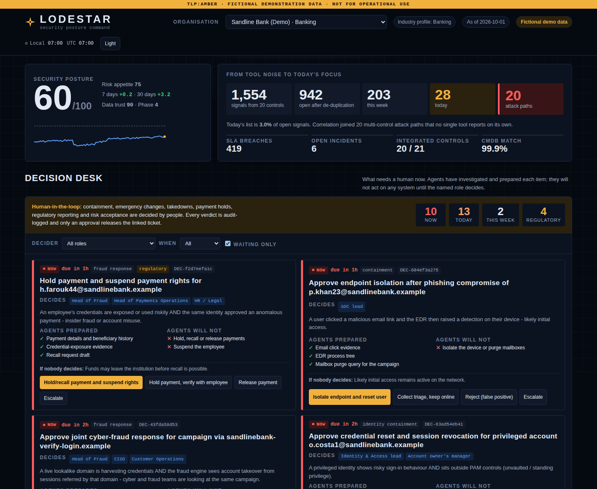
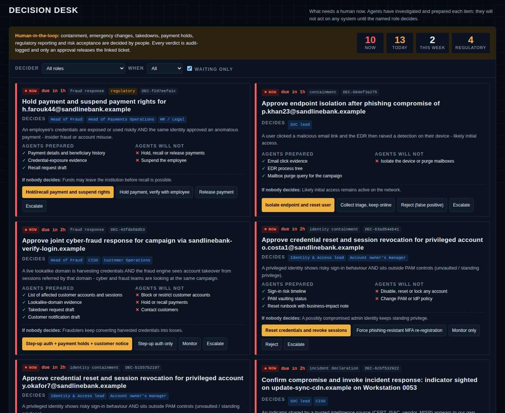
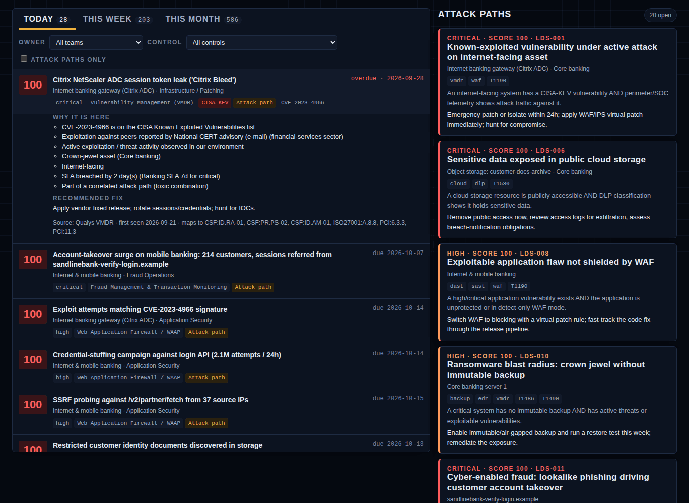
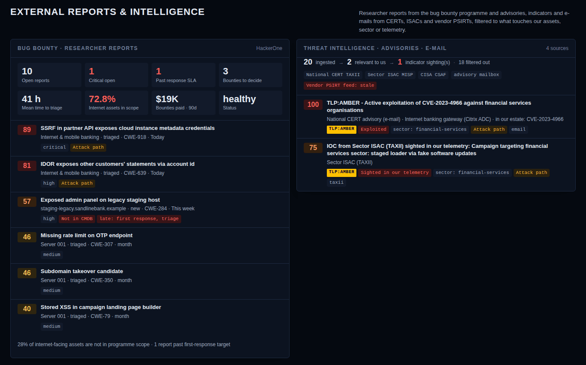
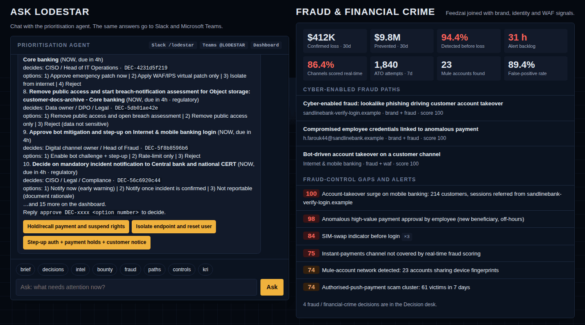
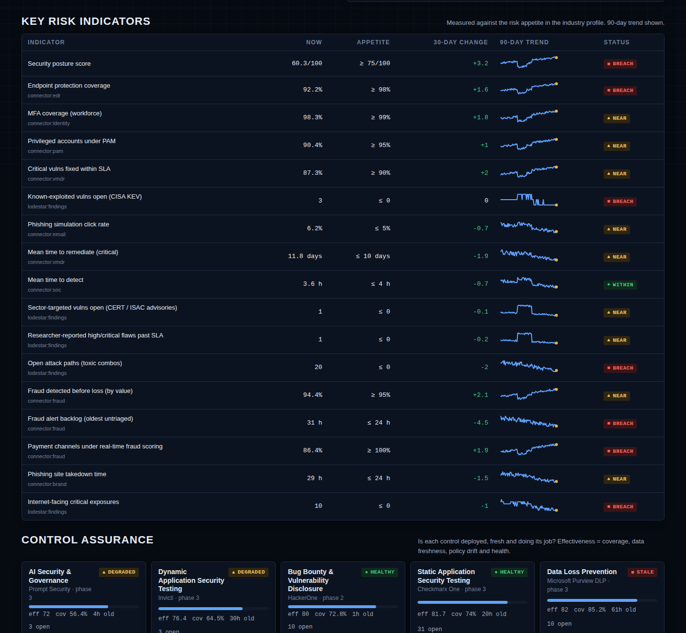
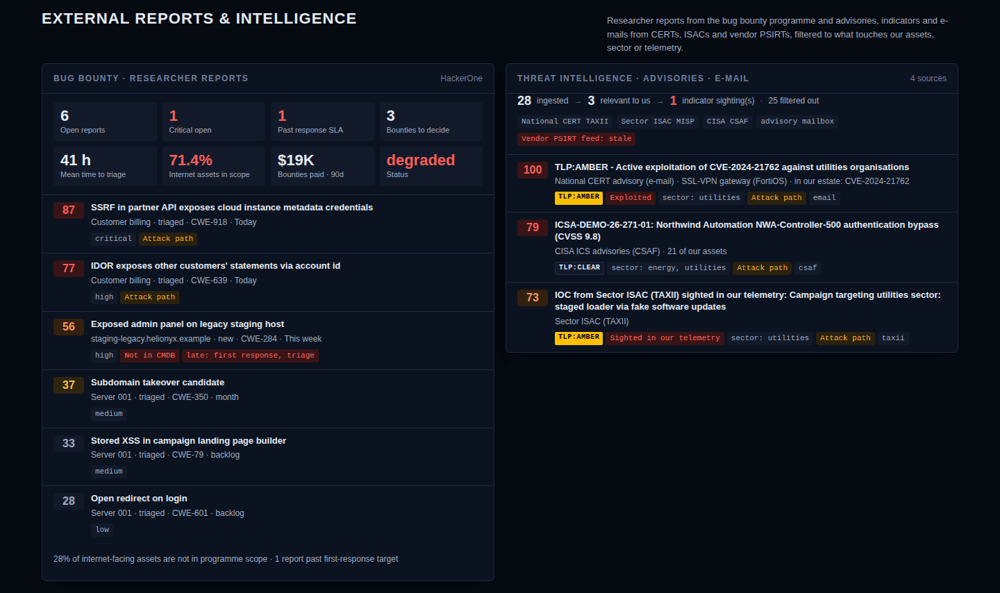
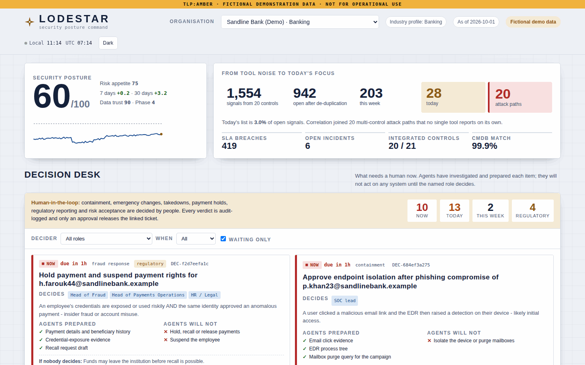
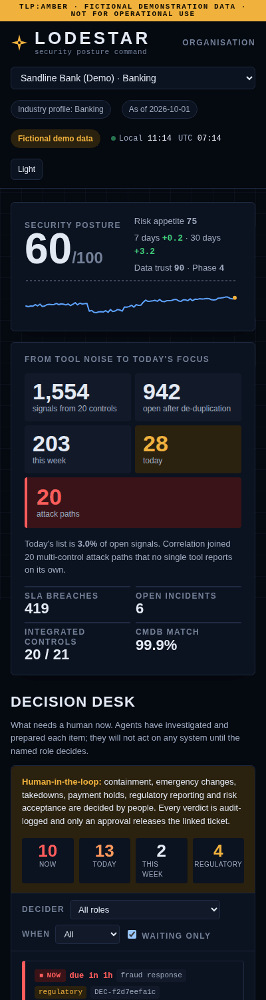
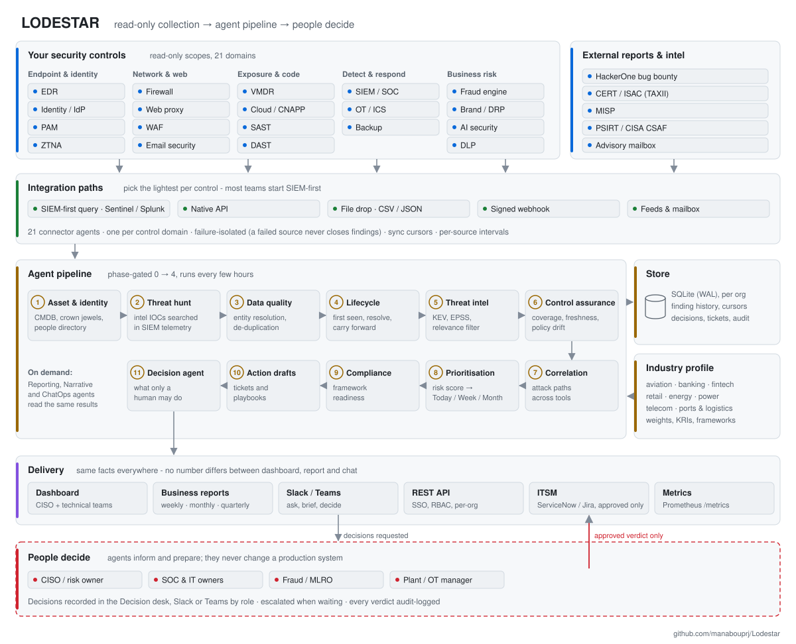

# LODESTAR

**Leadership-Oriented Defence: Exposure, Signal Triage And Reporting**

LODESTAR is a set of cooperating AI agents that read from the security tools you already own.
From that data it tells your security team what to work on **today, this week and this month**.
It also captures **bug bounty reports (HackerOne)** and **threat-intelligence feeds, advisories and
e-mails** from CERTs, ISACs and vendors, keeping what touches your assets. It queues the decisions
only a human may take, answers questions in **Slack and Microsoft Teams**, and writes the
**weekly, monthly and quarterly reports** that business leaders and boards actually read.

A lodestar is the star navigators steer by. The platform does the same job for a security team.

**[▶ Open the live demo dashboard](https://manabouprj.github.io/Lodestar/)** · [download it to open offline](samples/lodestar-dashboard.html) · [sample board report](samples/reports/sandline-bank-demo/2026-10-01_quarterly.md)

[](https://manabouprj.github.io/Lodestar/)

```
1,554 signals from 21 sources ─► 942 open ─► 203 this week ─► 28 today ─► 20 attack paths ─► 25 decisions for people
                                 (Sandline Bank, fictional demo, banking profile)
```

---

## What it achieves

| Outcome | How |
|---|---|
| **One priority list instead of 20 consoles** | 21 connector agents normalise EDR, firewall, VMDR, identity, PAM, cloud, ZTNA, web proxy, SOC/SIEM, SAST, DAST, WAF, brand protection, email, AI security, DLP, OT, backup, fraud, bug bounty and threat-intelligence data into one model |
| **A Today list a team can finish** | Explainable risk score with Today / This week / This month horizons and a capacity cap; every item says *why* it is there |
| **Outside warnings acted on, not lost in inboxes** | HackerOne reports (API + signed webhooks), STIX/TAXII, MISP, CISA ICS / vendor CSAF advisories and CERT/ISAC e-mails are captured, matched to assets by CVE, product and IOC, and turned into priorities and decisions. TLP is enforced, and critical-infrastructure notification deadlines are tracked |
| **Attacks that no single tool sees** | 16 correlation rules join signals into attack paths, e.g. a known-exploited bug under live attack on a crown jewel, lookalike phishing that turns into customer account takeover, or an ISAC indicator showing up in our own proxy logs |
| **Clear human accountability** | The Decision desk lists every action that needs a person: who decides, by when, what the agents prepared and what they will not do |
| **Security in the tools people already use** | Daily focus brief, urgent-decision alerts and two-way chat in Slack and Microsoft Teams |
| **Cyber and fraud in one view** | Fraud-engine signals joined with brand, identity and WAF signals for banks, fintechs, retailers, telcos and airlines |
| **Controls that are known to work** | Coverage, data freshness and policy drift measured for every control; a broken control becomes a finding |
| **Board-ready reporting** | KRIs against risk appetite, decisions requested from leadership, indicative financial exposure, framework readiness (NIST CSF 2.0, ISO 27001:2022, PCI DSS v4.0.1) |
| **One platform, any industry** | Industry profiles as YAML: banking, fintech, aviation, retail, oil & gas, power & utilities, telecom, ports & logistics |
| **Numbers you can defend** | Findings keep a history (first seen, carried forward when a tool is down, resolved only when the source says so); every KRI shows its source, and unmeasured KRIs never count as "within appetite" |
| **Running in a day or two** | `lodestar init` writes a SIEM-first configuration for your industry (Sentinel, Splunk, QRadar, Elastic, Sumo Logic or Google SecOps); `lodestar doctor` lists every gap with its fix; one deployment serves several organisations with SSO |

## Who it is for

LODESTAR scales from a single container for a small team to a multi-entity deployment for a
group or government CERT. The agents are the same at every size. Only the number of connectors,
entities and channels changes.

| Team | Typical situation | How LODESTAR is used | Footprint |
|---|---|---|---|
| **Small team** (1-5 people, often with an MSP/MDR) | A handful of tools, no SOC, the IT manager doubles as security lead | Phase 1 with 3-5 connectors through vendor APIs or CSV exports; the Today list and Slack/Teams brief *are* the operating rhythm; quarterly report for the owner/board | One container (2 vCPU, 4 GB), SQLite |
| **Mid-size organisation** (in-house security team, outsourced or small SOC) | 10-15 tools, too many alerts, monthly management reporting done by hand | Phases 1-3; team queues per owner; Decision desk for change and containment approvals; monthly and quarterly reports generated automatically | One container + scheduler |
| **Enterprise** (CISO organisation, 24x7 SOC, GRC, fraud) | 18+ tools, several business units, regulators, board scrutiny | All phases; per-team Slack/Teams channels; ITSM hand-off; fraud fusion; framework readiness for audit | Container platform, PostgreSQL store (roadmap), SSO proxy |
| **Group / multi-entity / MSSP** | Several subsidiaries or clients in different industries | One config per entity with its own industry profile; comparable posture and KRIs across entities | Same image, one config per entity |
| **Government & critical infrastructure** | Mission-critical operations, OT, CERT/ISAC advisories, strict accountability | Dark operations-centre dashboard with TLP marking; CERT/ISAC/ICS advisories matched to OT assets; mandatory-notification decisions with deadlines; OT and safety-critical decisions reserved to named roles; on-premises, no cloud dependency; LLM off by default | On-premises / air-gapped capable |

## How a team works with it

| Cadence | Who | Where | What they get |
|---|---|---|---|
| Continuously | SOC, on-call | Slack / Teams alert | New decisions that need a human **now**, e.g. an ISAC indicator sighted, a researcher report under attack |
| Every morning | CISO, security leads | Dashboard + daily brief in chat | Posture, decisions due, Today list, broken controls |
| During the day | Analysts, control owners | Dashboard, `/lodestar` in Slack, `@LODESTAR` in Teams | Team queue, "why is this here?", record decisions |
| Weekly | Technical leads | Weekly report | Today/This-week lists with owners and due dates, attack paths, decisions waiting, control health |
| Monthly | CISO, CIO, risk committee | Monthly report | KRIs vs appetite, trends, framework readiness, decisions requested |
| Quarterly | Board / ExCo | Quarterly report | Posture against appetite, financial exposure range, threat landscape, investment decisions |

## Human in the loop

| Agents do | Agents never do |
|---|---|
| Collect read-only data, de-duplicate, enrich with CISA KEV / EPSS | Isolate hosts, reset or disable accounts |
| Score, rank and explain every item | Change firewall, WAF, PAM, IdP or cloud policy |
| Correlate attack paths across tools | Take down domains or contact customers |
| Draft tickets, takedown requests, customer notices, STR narratives | Hold, recall or release payments; freeze accounts |
| Queue each decision for a named role with a deadline | File regulatory reports (breach, STR/SAR) |
| Record verdicts with an audit trail | Accept risk on anyone's behalf |

Only an approved verdict releases a ticket to ITSM, and ITSM starts in dry-run mode. See
[docs/HUMAN_IN_THE_LOOP.md](docs/HUMAN_IN_THE_LOOP.md).

## The dashboard

The dashboard is dark-first, built for 24x7 operations rooms, with TLP marking and local/UTC
clocks. A light theme is available. It is a single self-contained page: served by the API in
production, or exported as one HTML file for presentations and air-gapped reviews. The live demo
uses fictional data only.

| Decision desk | Focus queue and attack paths |
|---|---|
| What needs a human now, who decides, by when, and what the agents will not do<br> | Every item explains why it is on the list<br> |
| **External reports & intelligence:** HackerOne reports and CERT/ISAC/PSIRT advisories, filtered to what touches us<br> | **Ask LODESTAR, and fraud & financial crime:** the same agent answers in Slack and Teams<br> |
| **KRIs against appetite and control assurance**<br> | **Critical infrastructure:** an ICS advisory matched to 20 PLCs, HMIs and RTUs at a utility<br> |

<details>
<summary>Light theme and phone layout</summary>




</details>

What the dashboard shows, top to bottom:

1. **Posture and signal funnel:** posture vs appetite, data-trust confidence, and the funnel from tool noise to today's focus.
2. **Decision desk:** decisions waiting on people, grouped Now / Today / This week, filterable by decider role.
3. **Focus queue:** Today, This week and This month, filterable by owner team and control, with "why it's here" and the recommended fix.
4. **Attack paths:** correlated multi-tool risks with MITRE ATT&CK techniques.
5. **External reports & intelligence:** HackerOne reports (SLA, bounty decisions, assets not in the CMDB) and CERT/ISAC/PSIRT advisories shown as *ingested → relevant → sighted*, with TLP labels.
6. **Ask LODESTAR:** chat with the prioritisation agent. The same answers go to Slack and Teams.
7. **Fraud & financial crime:** confirmed loss, prevented loss, detection before loss, backlog, channel coverage, cyber-enabled fraud paths.
8. **KRIs, control assurance, posture trend, team workload, framework readiness, remediation actions.**

## Architecture

<picture>
  <source media="(prefers-color-scheme: dark)" srcset="docs/images/architecture-dark.svg">
  
</picture>

How to read it, top to bottom:

1. **Sources.** LODESTAR reads from the controls you already run, with read-only scopes, plus external reports and intelligence. It never writes to them.
2. **Integration paths.** Pick the lightest path per control. Most teams start **SIEM-first**: one read-only query per domain against the SIEM they already run (Sentinel, Splunk, QRadar, Elastic / OpenSearch, Sumo Logic, Google SecOps) covers most tools on day one; any other SIEM connects through REST, a signed webhook or a scheduled export. Native APIs, file drops and signed webhooks fill the gaps. Each control domain has its own connector agent, so one failing source never hides the others and never closes their findings.
3. **Agent pipeline.** The eleven core stages are phase-gated, so you switch them on as data quality allows (see [Deployment phases](docs/DEPLOYMENT_PHASES.md)). Finding history, connector cursors, decisions and the audit trail live in the store, scoped per organisation. The industry profile sets the weights, KRIs and frameworks for aviation, banking, fintech, retail, energy, power, telecom and ports.
4. **Delivery.** The dashboard, business reports, chat, API and metrics all read the same run, so no number differs between them.
5. **People decide.** Agents inform and prepare. A human's verdict is the only thing that sends an action to ServiceNow or Jira.

Details: [docs/ARCHITECTURE.md](docs/ARCHITECTURE.md) and [docs/AGENT_CATALOG.md](docs/AGENT_CATALOG.md). To regenerate the diagram after changing the pipeline, run `python scripts/make_architecture_svg.py`.

## Quick start

### Your own data in one to two days

```powershell
git clone https://github.com/manabouprj/Lodestar.git; cd Lodestar
py -3.12 -m venv .venv; .\.venv\Scripts\Activate.ps1; pip install -r requirements.txt
python -m lodestar init --org "Acme Bank" --vertical banking --siem sentinel --primary-domain acme.com
#   fill the blank credentials in .env, export your CMDB to config/assets.csv
python -m lodestar doctor                    # every gap, with its fix
python -m lodestar test-connector edr        # one domain at a time, nothing stored
python -m lodestar run; python -m lodestar serve
```

The day-by-day plan, including the pre-work to request a week ahead, is in
**[docs/QUICKSTART.md](docs/QUICKSTART.md)**. To run it as a service (SSO, several organisations,
monitoring, backups, upgrades), see **[docs/PRODUCTION.md](docs/PRODUCTION.md)**.

### Demo with fictional data

**Windows 11 (PowerShell)**

```powershell
git clone https://github.com/manabouprj/Lodestar.git
cd Lodestar
powershell -ExecutionPolicy Bypass -File scripts\setup.ps1 -Serve     # venv, tests, demo, serve
# open http://127.0.0.1:8080
```

**Linux / macOS**

```bash
./scripts/setup.sh --serve
```

**Docker**

```bash
cp .env.example .env                          # set API keys first
docker compose build
docker compose run --rm api python -m lodestar demo
docker compose up -d                          # API + dashboard + scheduler
```

**Talk to the agent without Slack or Teams**

```bash
python -m lodestar chat "what needs attention now?"
python -m lodestar chat --org sandline-bank-demo fraud
python -m lodestar chat                       # interactive
```

`python -m lodestar demo` builds eight **fictional** organisations, one per industry, and runs
every agent. It writes reports to `reports/` and an offline dashboard to
`dist/lodestar-dashboard.html` for presentations. Ready-made copies are in [`samples/`](samples/).

## Setting up the agents and integrating your tools

The full runbook is **[docs/AGENT_SETUP.md](docs/AGENT_SETUP.md)**. In short:

| Step | What you do | Check |
|---|---|---|
| 1. Platform | `python -m lodestar init` writes the live config (SIEM-first templates for your industry) and `.env` with generated keys and secrets | `python -m lodestar doctor` |
| 2. Asset context | Export the CMDB / crown-jewel register to `config/assets.csv` (criticality 1-5, exposure, `aliases`, `vendor:`/`product:` tags) | CMDB match rate ≥ 90 % |
| 3. Connector agents, one at a time | Credentials in `.env` → connector block in `config/lodestar.yaml` (native adapter, file drop with `field_map`, or signed webhook) | `python -m lodestar test-connector <domain>` |
| 4. Core agents | Decision-desk RACI, scoring and Today capacity, ITSM (dry-run), Slack/Teams, threat-intel refresh | `python -m lodestar run --phase N` |
| 5. Go live | `docker compose up -d`, or two Windows scheduled tasks (API + scheduler) | Dashboard → Control assurance all healthy |

```powershell
python -m lodestar test-connector edr --show 10      # run one agent against the real product, nothing stored
powershell -ExecutionPolicy Bypass -File scripts\send-test-webhook.ps1 -Domain waf -File samples\webhooks\waf_findings.json
```

Per-product guidance covers: the Microsoft Entra app registration (Defender XDR, Sentinel, Entra
ID Protection, Mail.Read scoped to one mailbox), Tenable API keys, HackerOne tokens and webhooks,
TAXII/MISP/CSAF feeds, and file-drop field maps for CrowdStrike, Palo Alto, Cloudflare, Zscaler,
CyberArk, Wiz, Checkmarx, Invicti, Recorded Future, Purview DLP, Claroty, Rubrik and fraud engines.

## Integrations

LODESTAR reads from the tools you already run, read-only. It connects in one of six ways, and most
teams start with the first:

1. **SIEM-first.** One read-only query per control domain against your SIEM, for every tool that already
   forwards to it. One credential and one network path cover most of phase 1.
2. **Native adapters.** Microsoft Graph Security, Entra ID Protection, Tenable, HackerOne, TAXII, MISP, CSAF and mailbox.
3. **REST / JSON.** The `http_json` adapter reads any product or SIEM with a JSON read API. No code needed.
4. **File drop.** CSV or JSON exports with a field map.
5. **Signed webhook.** Pushed from the product, a SOAR or MERIDIAN, per organisation.
6. **Vendor MCP server.** The `mcp` adapter calls one read-only tool on a product's Model Context Protocol
   server and maps the result like `http_json`. Tools that are not read-only are refused.

### Supported SIEM platforms

| SIEM | How LODESTAR reads it | Threat-intel hunting | Status |
|---|---|---|---|
| Microsoft Sentinel | KQL, Azure Monitor Logs API | Yes | Native |
| Splunk Enterprise / Cloud / ES | SPL, REST search export | Yes | Native |
| IBM QRadar (on-prem and SaaS) | AQL (Ariel) and open offenses | Yes | Native |
| Elastic Security, OpenSearch, Wazuh | ES\|QL or Query DSL | Yes | Native |
| Sumo Logic | Search Job API | Not yet | Native |
| Google Security Operations (Chronicle) | UDM search, Chronicle API | Not yet | Preview |
| MERIDIAN | Signed webhook (push) | Built in | Native |
| LogRhythm, Exabeam, Securonix, FortiSIEM, InsightIDR, ArcSight, Falcon Next-Gen SIEM, others | `http_json`, signed webhook or file drop | No | Generic |

`lodestar init --siem <sentinel|splunk|qradar|elastic|sumologic|google_secops>` writes ready-made,
least-privilege queries for each domain. **[docs/SIEM_INTEGRATION.md](docs/SIEM_INTEGRATION.md)** has the
permissions, setup, field mapping, hunting and limits for each platform.

### Control domains and example products

| Control | Example products | Phase |
|---|---|---:|
| EDR, VMDR, Identity, SOC/SIEM, Email | CrowdStrike, Defender, SentinelOne · Qualys, Tenable, Rapid7 · Entra ID, Okta · Sentinel, Splunk, QRadar, Elastic, Sumo Logic, Google SecOps · Defender for O365, Mimecast, Proofpoint | 1 |
| Firewall, WAF, Web proxy, ZTNA, PAM, Cloud, **Fraud** | Palo Alto, Fortinet, Check Point · Cloudflare, Akamai, F5 · Zscaler, Netskope · CyberArk, BeyondTrust, Delinea · Wiz, Defender for Cloud, Prisma · Feedzai, Actimize, SAS, FICO, BioCatch | 2 |
| SAST, DAST, Brand, AI security, DLP, OT, Backup | Checkmarx, Veracode, Snyk · Invicti, Burp · Recorded Future, ZeroFox · Purview AI, Lakera, Prompt Security · Purview DLP, Forcepoint · Claroty, Nozomi, Dragos · Rubrik, Cohesity, Veeam | 3 |
| Threat intelligence & advisories | National CERT / ISAC TAXII 2.1, MISP, CISA ICS & vendor PSIRT CSAF 2.0, advisory mailbox (IMAP / Microsoft Graph / .eml) | 1 |
| Bug bounty / VDP | HackerOne (API + signed webhooks), security@ mailbox | 2 |
| Chat & ticketing | Slack, Microsoft Teams · ServiceNow, Jira | 2 |

Products without a native adapter are reached through the SIEM, REST, a file drop or a webhook. See
[docs/CONNECTOR_GUIDE.md](docs/CONNECTOR_GUIDE.md). The SIEM is also used to **hunt threat-intel
indicators** in your telemetry every run, so an ISAC indicator seen in your own logs becomes a
priority.

## Phased rollout

| Phase | Weeks* | Adds | Value delivered |
|---:|---|---|---|
| 0 | 0-2 | Platform, CMDB / crown jewels, demo | Stakeholder buy-in |
| 1 | 3-6 | EDR, VMDR, Identity, SOC, Email; CERT/ISAC/PSIRT feeds and advisory mailbox; scoring; weekly report | Daily Today list, advisories matched to our estate |
| 2 | 7-10 | Firewall, WAF, Proxy, ZTNA, PAM, Cloud, Fraud, HackerOne; correlation; Decision desk; Slack/Teams | Attack paths, accountable decisions, chat |
| 3 | 11-14 | SAST, DAST, Brand, AI, DLP, OT, Backup; compliance mapping; monthly report | Full coverage, framework readiness |
| 4 | 15-18 | Board report, optional LLM narrative, more entities, live ITSM | Executive and group scale |

\* Indicative for one organisation's full rollout, including approvals and tuning. With SIEM-first
integration, phases 0-1 on your own data take one to two days ([QUICKSTART.md](docs/QUICKSTART.md)).
Each phase has a go-live gate: `python -m lodestar doctor` with no failures at that `deployment_phase`.
See [docs/DEPLOYMENT_PHASES.md](docs/DEPLOYMENT_PHASES.md).

## Ingestion operations

Every source has a fetch cadence. Alerts and detections (SOC, EDR, fraud) are pulled every 15 minutes,
identity and e-mail every 30, network and intel hourly, cloud and PAM every 4 hours, scans every 6, code
analysis daily. Set `interval_minutes` on any source to change it. `lodestar check-ingestion` is the
sanity test: it fetches every source now and grades it PASS, WARN or FAIL (reachability, volume, schema
drift, field mapping, CMDB match, freshness), and stores nothing. Inside every run the
IngestionMonitorAgent validates each source. It raises a finding and a Slack, Teams or webhook alert
when a source is failing (two failed fetches in a row), stale, silent or drops in volume, and resolves it
when the source recovers. A single failed fetch never makes a control look dead, and never closes its
findings. See **[docs/INGESTION_OPERATIONS.md](docs/INGESTION_OPERATIONS.md)**.

## MCP server for AI assistants

LODESTAR is one governed MCP endpoint (`/mcp/`, or `lodestar mcp` over stdio) for Claude, Copilot,
Foundry or Bedrock agents and IDEs. Assistants get prioritised, de-duplicated and correlated answers
("what do we fix today?", "is the EDR feed healthy?") through twelve read-only tools. They use the same
API keys or SSO tokens, roles and organisation scoping as the dashboard. No assistant needs its own
credentials to twenty consoles. See **[docs/MCP.md](docs/MCP.md)**.

## Commands

| Command | Purpose |
|---|---|
| `python -m lodestar init` | Generate a live config for your organisation and industry (SIEM-first), `.env` secrets, CMDB template; `--tenant` adds an organisation |
| `python -m lodestar doctor [--online]` | Readiness report: config, secrets, CMDB, every connector source, KRIs, SSO, backups, network |
| `python -m lodestar demo` | Demo data for 8 industries → run → reports → dashboard |
| `python -m lodestar run [--org key] [--force]` | Run the agents once for every organisation (or one) |
| `python -m lodestar kpis` | Where every KRI comes from, and how to measure the missing ones |
| `python -m lodestar backup [--out file]` | Online backup of the store |
| `python -m lodestar serve` | API, dashboard, Slack/Teams endpoints |
| `python -m lodestar schedule [--tick-minutes 15]` | Wakes every tick, fetches each source on its own cadence, validates ingestion and alerts, posts the brief, writes reports on calendar boundaries |
| `python -m lodestar check-ingestion [--domain d] [--json] [--full]` | Ingestion sanity test: every source fetched now, PASS / WARN / FAIL, exit 1 on FAIL (nothing stored) |
| `python -m lodestar mcp [--role analyst] [--org key]` | MCP server over stdio for a local AI client (network clients use `/mcp/` on the API) |
| `python -m lodestar chat [question]` | Ask the prioritisation agent from the terminal |
| `python -m lodestar notify --channel slack\|teams\|stdout` | Push the focus brief now |
| `python -m lodestar report --period weekly\|monthly\|quarterly\|all` | Write reports (HTML, Markdown, JSON) |
| `python -m lodestar validate [--phase N]` | Config, secrets and readiness checks |
| `python -m lodestar test-connector <domain>` | Run one connector agent against the real product and show what it collected (nothing stored) |
| `python -m lodestar export-dashboard` | Offline dashboard file |
| `python -m lodestar agents` | Agent catalogue |

## Repository layout

```
lodestar/
  agents/connectors/   21 connector agents + adapters (Sentinel, Splunk, QRadar, Elastic/OpenSearch, Sumo Logic,
                       Google SecOps, Graph Security, Entra, Tenable, HackerOne, TAXII/STIX, MISP, CSAF, mailbox,
                       http_json, mcp, file_drop, webhook, mock)
  agents/core/         asset context, threat hunt, data quality, ingestion monitor, lifecycle, threat intel, control assurance,
                       correlation, prioritisation, compliance, action, decision desk, narrative
  entities.py          asset and identity resolution (FQDN, IP, MAC, device ids, UPN / sam / object id)
  onboarding.py        `init` and `doctor`
  ingestion.py         ingestion expectations and checks (sanity test + continuous monitor)
  mcp_server.py        MCP server: read-only, org-scoped tools for AI assistants (/mcp/ and stdio)
  ops.py               Prometheus metrics, JSON logging
  api/auth.py          OIDC SSO, bearer JWT, org-scoped API keys, signed sessions, CSRF
  chatops/             chat engine, Slack, Microsoft Teams, notifier
  scoring.py           explainable LODESTAR Risk Score
  decisions.py         recording human verdicts (role checks, audit, ITSM release)
  reporting.py         weekly / monthly / quarterly reports
  api/app.py           REST API, RBAC, webhook ingest, chat endpoints, dashboard
  demo/generator.py    fictional demo data for 8 industries
config/                platform config, industry profiles, framework mappings, templates/catalog.yaml, tenants/
docs/                  architecture, scoring, phases, human-in-the-loop, ChatOps, fraud, security, peer review, demo script
samples/               dashboard and reports generated from the demo data
tests/                 130+ tests, incl. contract tests against recorded vendor responses
```

## Security

The platform is built to tier-0 standards. Connectors only read. Secrets come from the
environment, and the config loader rejects literal secrets. People sign in with OIDC single
sign-on, with groups mapped to roles and organisations. Automation uses org-scoped API keys or
bearer tokens. Cookie sessions are signed and CSRF-protected. Webhooks and Slack/Teams requests
are HMAC-verified. The container runs non-root on a read-only
filesystem. Every agent run and verdict is audit-logged. The LLM narrative is off by default and
only sees aggregates. See [docs/SECURITY.md](docs/SECURITY.md).

## Documentation

| Document | For |
|---|---|
| [QUICKSTART.md](docs/QUICKSTART.md) | **Start here:** your own data in one to two days (pre-work, `init`, `doctor`, first run) |
| [AGENT_SETUP.md](docs/AGENT_SETUP.md) | Per-product setup: permissions, credentials, field maps, testing |
| [PRODUCTION.md](docs/PRODUCTION.md) | SSO, several organisations, monitoring, backups, upgrades, finding lifecycle, hardening |
| [HUMAN_IN_THE_LOOP.md](docs/HUMAN_IN_THE_LOOP.md) | Decision desk, decision types, guard-rails |
| [CHATOPS.md](docs/CHATOPS.md) | Slack and Teams setup, roles in chat |
| [FRAUD_MANAGEMENT.md](docs/FRAUD_MANAGEMENT.md) | Cyber-enabled fraud for financial institutions |
| [EXTERNAL_INTEL.md](docs/EXTERNAL_INTEL.md) | Bug bounty, CERT/ISAC/PSIRT feeds, advisory e-mail, TLP, critical-infrastructure notification |
| [GITHUB_SETUP.md](docs/GITHUB_SETUP.md) | Pushing to GitHub from Windows, publishing the demo dashboard on GitHub Pages |
| [SCORING_MODEL.md](docs/SCORING_MODEL.md) | How priorities are calculated |
| [DEPLOYMENT_PHASES.md](docs/DEPLOYMENT_PHASES.md) | Rollout plan and exit criteria |
| [INGESTION_OPERATIONS.md](docs/INGESTION_OPERATIONS.md) | Ingestion cadence per domain, the sanity test, continuous validation, alerts and metrics |
| [MCP.md](docs/MCP.md) | The LODESTAR MCP server for AI assistants and agents, and the vendor MCP adapter |
| [SIEM_INTEGRATION.md](docs/SIEM_INTEGRATION.md) | **Supported SIEM platforms**: Sentinel, Splunk, QRadar, Elastic / OpenSearch / Wazuh, Sumo Logic, Google SecOps, MERIDIAN and any other SIEM; permissions, setup, hunting, limits |
| [CONNECTOR_GUIDE.md](docs/CONNECTOR_GUIDE.md) | Connecting products |
| [AGENT_CATALOG.md](docs/AGENT_CATALOG.md) | Every agent, rule and industry profile |
| [PEER_REVIEW.md](docs/PEER_REVIEW.md) | Review findings, fixes and open items |
| [DEMO_SCRIPT.md](docs/DEMO_SCRIPT.md) | 15-minute presentation walkthrough |

## Status and roadmap

Version 2.3.0 is production-ready for a single node serving one or many organisations. It includes:

* per-source ingestion cadence, an ingestion sanity test, and continuous ingestion validation with alerts;
* a read-only MCP server for AI assistants, and an adapter for vendor MCP servers;
* finding lifecycle with history;
* asset and identity resolution;
* SIEM-first connectors for six SIEM platforms, plus a generic REST adapter, and IOC hunting in four of them;
* KRI provenance;
* OIDC single sign-on and org-scoped access;
* metrics, readiness checks and backups;
* `init` and `doctor`.

The native and SIEM adapters follow the vendors' published APIs and are covered by contract tests
against recorded responses. Validate them against your own tenant in the first week (see
[QUICKSTART.md](docs/QUICKSTART.md)).

Planned next:

* native adapters for CrowdStrike, Qualys, Zscaler, CyberArk, Wiz, Cloudflare, Feedzai and Bugcrowd;
* threat-intel hunting in Sumo Logic and Google SecOps, and Google SecOps out of preview after tenant validation;
* a PostgreSQL store for active-active high availability;
* a full Teams bot with card actions.

Open items are tracked in [docs/PEER_REVIEW.md](docs/PEER_REVIEW.md). Changes per release are in [CHANGELOG.md](CHANGELOG.md).

## License

LODESTAR is licensed under the [Apache License 2.0](LICENSE). You may use, modify and run it,
including commercially and in production, provided you keep the copyright and [NOTICE](NOTICE),
state significant changes, and include the licence when you redistribute it. It comes **without
warranty**: you are responsible for validating it in your environment (see
[PEER_REVIEW.md](docs/PEER_REVIEW.md) for open items). Contributions are accepted under the same
licence (Apache-2.0, section 5).

All demo organisations, people, hosts and `*.example` domains are fictional. CVE identifiers are
real public CVEs used for illustration.
